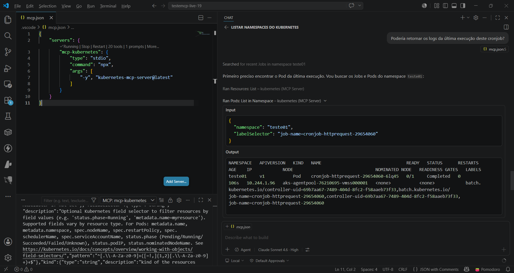
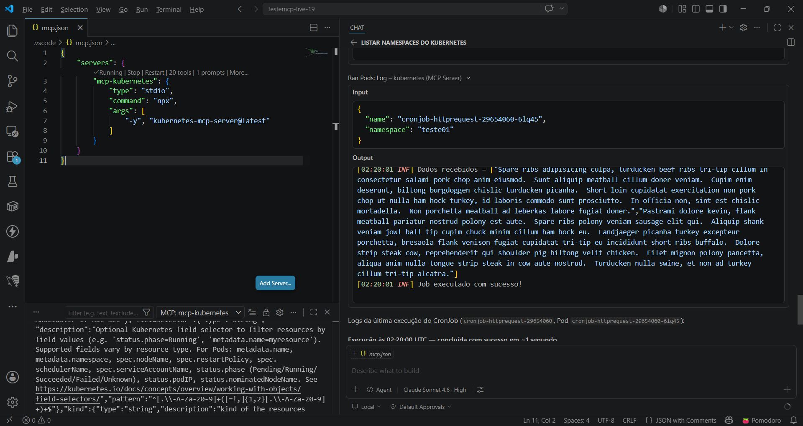
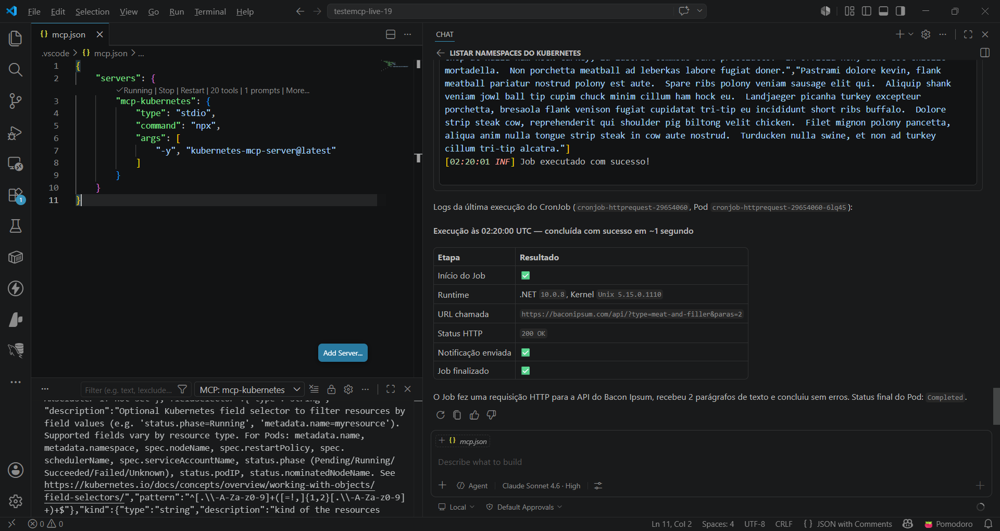

# kubernetes-mcp-vscode-githubcopilot
Configurações para uso do MCP Server do Kubernetes (npm) com Visual Studio Code + GitHub Copilot. 

MCP Server para Kubernetes "oficial": https://github.com/containers/kubernetes-mcp-server

Arquivo **mcp.json** (diretório **.vscode**):

```json
{
	"servers": {
		"mcp-kubernetes": {
			"type": "stdio",
			"command": "npx",
			"args": [
				"-y", "kubernetes-mcp-server@latest"
			]
		}
	}
}
```

Um exemplo de teste com este MCP Server:





